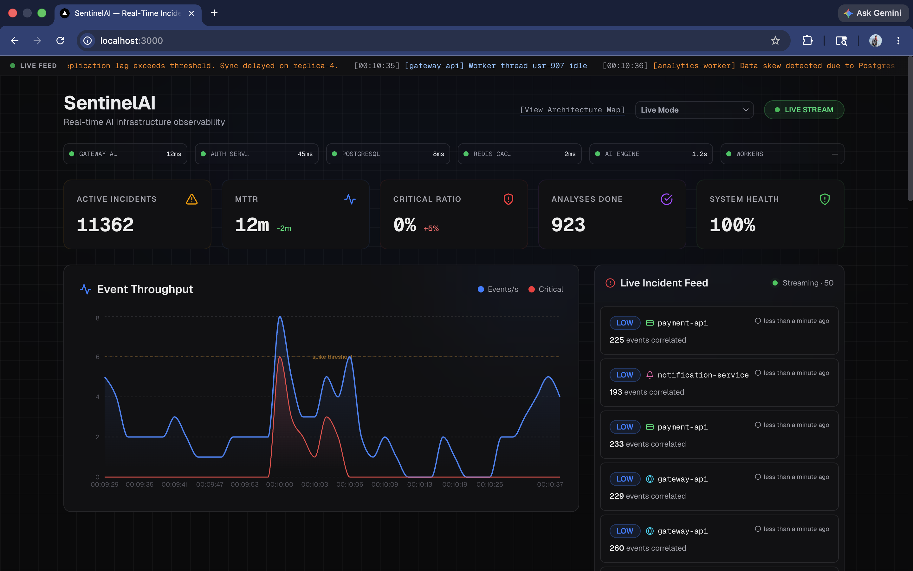
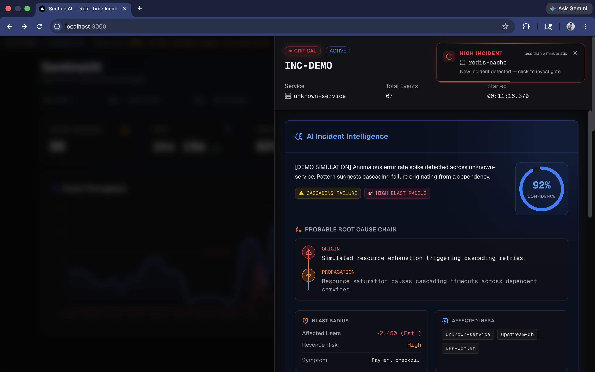
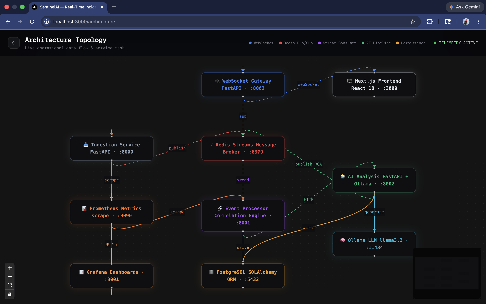
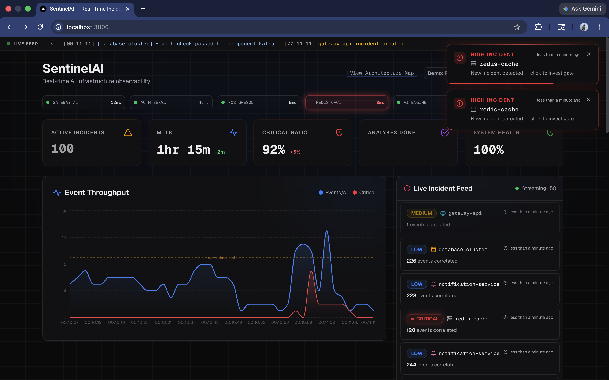
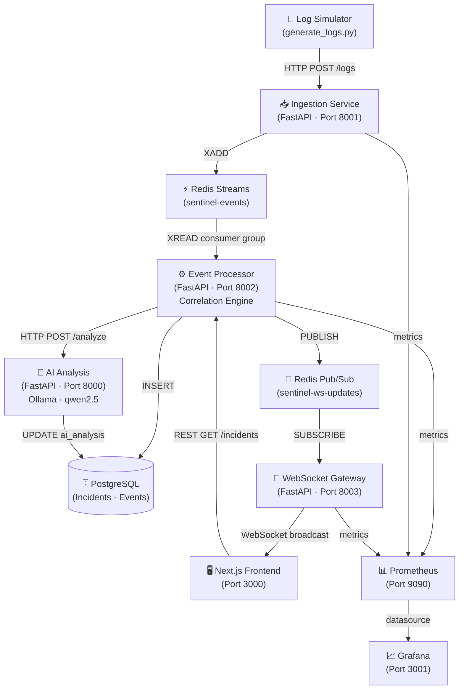

<div align="center">

# SentinelAI

### AI-Native Real-Time Incident Intelligence Platform

[](https://github.com)
[](LICENSE)
[](#)
[](#)
[](#)
[](#)
[](#)
[](#)
[](#)

**A production-grade distributed observability platform** that autonomously ingests telemetry, correlates infrastructure incidents, and delivers AI-generated root-cause analysis in real time — powered by async microservices, Redis Streams, WebSocket broadcasting, and local LLM inference.

[Architecture](#-architecture) · [Engineering Decisions](#-engineering-decisions) · [Quick Start](#-quick-start) · [Demo Scenarios](#-demo-scenarios) · [Deployment](#-deployment)

</div>

---

## Screenshots

| Dashboard | Incident Detail |
|-----------|-----------------|
|  |  |

| Architecture Map | Live Feed |
|-----------------|-----------|
|  |  |

---

## Platform Overview

SentinelAI is a full-stack, event-driven observability platform designed to mirror the architecture of production NOC (Network Operations Center) systems. It demonstrates:

- **Async microservices** coordinating over message streams
- **Real-time event correlation** with sliding-window incident grouping
- **AI-powered root-cause analysis** via local Ollama LLM inference
- **WebSocket-fed command center dashboard** with sub-second latency
- **Production resilience patterns** including heartbeat reconnects, exponential backoff, connection pooling, and bounded in-memory state

---

## Architecture



### Service Responsibilities

| Service | Port | Role |
|---------|------|------|
| `ingestion-service` | 8001 | Validates & writes telemetry to Redis Streams |
| `event-processor` | 8002 | Consumes stream, correlates incidents, exposes REST API |
| `ai-analysis` | internal | Performs LLM-based root-cause analysis on new incidents |
| `websocket-gateway` | 8003 | Relays Redis Pub/Sub events to browser WebSocket clients |
| `frontend` | 3000 | Next.js 14 NOC dashboard with real-time incident feed |

---

## Engineering Decisions

> This section is intended for technical interviews and architectural review. Each decision reflects a deliberate tradeoff.

### Why Redis Streams?
Redis Streams provides durable, ordered, consumer-group-aware message delivery — unlike plain Pub/Sub which drops messages for offline consumers. This enables exactly-once processing semantics, replay capability, and horizontal scaling via named consumer groups without requiring Kafka infrastructure.

### Why decoupled AI analysis?
AI inference (LLM calls) is the highest-latency operation in the pipeline (~2–30s). Running it synchronously in the correlation loop would block event throughput under burst traffic. AI analysis is triggered as a fire-and-forget `asyncio.create_task`, gated by a semaphore (`MAX_CONCURRENT_AI_CALLS = 5`) to prevent queue explosion, with a hard per-call timeout.

### Why WebSockets over SSE or polling?
Full-duplex WebSockets enable the server to push at exactly the moment an incident occurs, eliminating the latency floor of polling intervals. They also enable client-to-server heartbeats, which allows the gateway to detect and evict stale connections without waiting for a failed write.

### Why async FastAPI?
The entire backend pipeline is I/O-bound: database queries, Redis reads/writes, and HTTP calls to the AI service. Python's `asyncio` + SQLAlchemy async sessions achieve high concurrency on a single thread without the overhead of multi-process parallelism.

### Why bounded frontend state?
Browser memory is a finite resource. The dashboard caps incidents at 50 items, chart points at 40, and ticker events at 30. Without these bounds, a long-running session would accumulate thousands of entries, degrading React rendering performance. The WebSocket message queue is also batched and flushed via `requestAnimationFrame` debouncing to coalesce rapid backend bursts into single render passes.

### Why the repository pattern?
All database access is routed through repository classes in `shared/repositories/`. This decouples service logic from SQLAlchemy session management, makes unit testing straightforward (swap repository for a mock), and ensures consistent error handling and session lifecycle across services.

### Why connection pooling?
Each async FastAPI service maintains a SQLAlchemy `AsyncEngine` with `pool_size=5`, `max_overflow=10`, and `pool_pre_ping=True`. This avoids the overhead of creating a new TCP connection per request while ensuring stale connections are detected before use.

### Why heartbeat + reconnect?
Browser WebSocket connections are silently dropped by load balancers, mobile network switches, and OS-level TCP keepalive timeouts. The frontend hook sends a `ping` frame every 25 seconds and expects a `pong` within 5 seconds. On failure, it reconnects with exponential backoff (1s → 2s → 4s → ... → 30s cap) to avoid thundering-herd reconnect storms.

---

## Core Capabilities

### Backend
- **Async log ingestion** via FastAPI with Pydantic validation
- **Redis Streams consumer group** with at-least-once delivery semantics
- **Sliding-window correlation engine** — groups events into incidents by service + severity + message similarity (Jaccard coefficient)
- **AI analysis pipeline** — semaphore-gated, timeout-bound, fire-and-forget LLM calls
- **PostgreSQL persistence** with async SQLAlchemy, Alembic migrations, and repository pattern
- **Prometheus metrics** across all services — incidents created, processing latency, WebSocket connection count

### Frontend
- **Next.js 14 App Router** with React Server Components where applicable
- **WebSocket hook** with heartbeat, exponential backoff reconnect, and connection state machine
- **Batched state updates** — WS messages debounced and flushed in a single React render pass
- **Bounded collections** — all live data structures capped to prevent memory growth
- **Error boundaries** — each major UI zone is independently fault-isolated
- **Demo Mode** — full in-browser incident simulation requiring zero backend changes

### Observability
- Prometheus scrape endpoints on all FastAPI services
- Pre-built Grafana dashboards for incident throughput, processing latency, and WebSocket connections
- Structured JSON logging with correlation context (`service`, `severity`, `incident_id`)

---

## Project Structure

```
sentinel-ai/
├── services/
│   ├── ingestion-service/     # Log intake, Redis Streams writer
│   ├── event-processor/       # Correlation engine, REST API
│   │   └── correlation/       # engine.py — core incident logic
│   ├── ai-analysis/           # LLM root-cause analysis
│   └── websocket-gateway/     # Redis Pub/Sub → WebSocket relay
│
├── shared/                    # Shared Python library (installed in all services)
│   ├── config/settings.py     # Pydantic settings (env-driven)
│   ├── db/models.py           # SQLAlchemy ORM models
│   ├── db/session.py          # Async engine + session factory
│   ├── repositories/          # DB access layer
│   ├── websocket/pubsub.py    # Redis Pub/Sub publisher
│   ├── metrics/prometheus.py  # Shared metric definitions
│   └── logging/logger.py      # Structured logger factory
│
├── frontend/                  # Next.js 14 dashboard
│   └── src/
│       ├── app/page.tsx        # Main dashboard — WS state machine
│       ├── components/         # IncidentFeed, DetailModal, Ticker, etc.
│       └── hooks/useWebSocket.ts
│
├── infra/
│   ├── prometheus.yml          # Scrape config
│   └── grafana/                # Provisioned dashboards
│
├── scripts/
│   └── generate_logs.py        # Realistic log traffic simulator
│
├── docs/
│   ├── architecture.md
│   ├── deployment.md
│   ├── ai-pipeline.md
│   ├── websocket-flow.md
│   └── scaling.md
│
├── docker-compose.yml          # Local development stack
├── docker-compose.prod.yml     # Production resource limits + health checks
└── .env.example                # Environment variable template
```

---

## Quick Start

### Prerequisites

- [Docker Desktop](https://www.docker.com/products/docker-desktop/) (v24+)
- [Ollama](https://ollama.ai) — for local LLM inference *(optional — system works without it)*

### 1. Clone & Configure

```bash
git clone https://github.com/your-username/sentinel-ai.git
cd sentinel-ai
cp .env.example .env
```

The defaults in `.env.example` are configured for the Docker Compose network and require no changes for local development.

### 2. Pull AI Model (Optional)

```bash
# Install Ollama: https://ollama.ai
ollama pull qwen2.5
```

If Ollama is unavailable, the AI analysis service falls back to structured placeholder analysis — all other platform features remain fully operational.

### 3. Start the Stack

```bash
docker compose up -d
```

This starts: PostgreSQL, Redis, Ingestion Service, Event Processor, AI Analysis, WebSocket Gateway, Frontend, Prometheus, Grafana, and the Log Simulator.

### 4. Verify All Services

```bash
docker compose ps
```

| Service | URL | Expected |
|---------|-----|----------|
| Dashboard | http://localhost:3000 | NOC command center |
| Event Processor API | http://localhost:8002 | `{"status":"running"}` |
| WebSocket Gateway | ws://localhost:8003/ws | WebSocket endpoint |
| Grafana | http://localhost:3001 | admin / admin |
| Prometheus | http://localhost:9090 | Metrics explorer |

### 5. Confirm Live Data

```bash
# Active incidents
curl http://localhost:8002/incidents | jq '.incidents | length'

# Platform stats
curl http://localhost:8002/stats | jq
```

The log simulator starts automatically and continuously generates realistic service telemetry. Incidents will appear within ~30 seconds.

---

## Demo Scenarios

The dashboard includes four built-in Demo Mode scenarios, selectable from the mode dropdown in the top-right corner. These are fully self-contained in the browser — no backend interaction required.

| Scenario | Simulates |
|----------|-----------|
| **DB Saturation** | Connection pool exhaustion → cascading query timeouts |
| **Redis Collapse** | Cache layer failure → upstream latency spike |
| **Auth Storm** | Credential validation retry storms → token service overload |
| **Gateway Cascading** | API gateway saturation → downstream service degradation |

Each scenario runs autonomously, generating realistic incident sequences with AI root-cause analysis, propagation chains, and operational playbooks.

---

## Performance & Stability

| Concern | Implementation |
|---------|---------------|
| Frontend memory growth | All collections bounded (incidents: 50, chart: 40, ticker: 30) |
| WebSocket burst traffic | 80ms debounce → single batched React render pass |
| Stale WS connections | Heartbeat ping/pong every 25s; dead clients evicted before broadcast |
| Reconnect storms | Exponential backoff: 1s → 2s → 4s → ... → 30s cap |
| AI runaway tasks | `asyncio.Semaphore(5)` cap + 90s per-call timeout |
| Redis pool exhaustion | Shared `aioredis` connection pool with pre-ping health check |
| Service crash isolation | `ErrorBoundary` wraps each major dashboard zone independently |
| DB connection saturation | SQLAlchemy pool: `size=5`, `max_overflow=10`, `pre_ping=True` |

---

## Future Roadmap

| Feature | Description |
|---------|-------------|
| Vector memory | `pgvector` extension for semantic incident search and RAG-based analysis |
| Historical AI context | Cross-incident pattern recognition using embedding similarity |
| Kubernetes ingestion | HPA-aware consumer groups for elastic log ingestion |
| Alerting integrations | Slack / PagerDuty / Teams webhooks for critical incident escalation |
| Incident timeline replay | Reconstruct historical incident sequences for post-mortems |

---

## What This Project Demonstrates

For technical interviewers and engineering teams:

| Area | Evidence |
|------|----------|
| **Distributed systems** | Multi-service architecture with async message passing, consumer groups, and independent failure domains |
| **Event-driven design** | Redis Streams as durable event bus; correlation engine as a stateless consumer |
| **Async programming** | Full async/await Python stack — ingestion, correlation, AI analysis, and DB access |
| **Real-time frontend** | WebSocket state machine with heartbeat, reconnect, and batched React updates |
| **Observability** | Self-instrumented platform with Prometheus metrics and Grafana dashboards |
| **AI systems** | Async, semaphore-gated LLM integration with graceful degradation |
| **Resilience engineering** | Exponential backoff, circuit-isolation, bounded state, health checks |
| **Production readiness** | Docker Compose with resource limits, health-check dependency ordering, structured logging, and CORS hardening |

---


<div align="center">

Built with async Python, Next.js, Redis Streams, and a healthy obsession with distributed systems.

</div>
