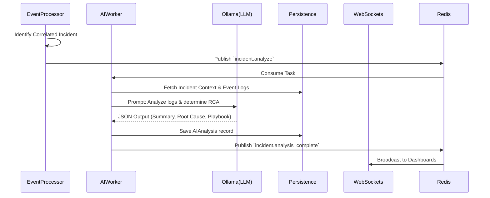

# AI Root Cause Analysis Pipeline

SentinelAI leverages local Large Language Models (LLMs) to perform autonomous infrastructure analysis. This document details the pipeline from telemetry ingestion to actionable remediation.

## Pipeline Architecture



## 1. Prompt Engineering Strategy

The core of the AI pipeline is structured prompt injection. When an incident is flagged for analysis, the AI Worker extracts:
- Affected microservices
- Timeline of log events
- Error severities

The prompt strictly instructs the LLM to return output in a **parseable JSON structure**.

### Example JSON Output Schema:
```json
{
  "summary": "Brief 2-sentence explanation of the failure cascade.",
  "confidence": 0.92,
  "root_cause": "Detailed technical root cause.",
  "remediation": ["Step 1", "Step 2", "Step 3"]
}
```

## 2. Confidence Engine
The `confidence` metric is probabilistically mapped by the LLM based on the clarity of the logs. If logs explicitly state "connection pool exhausted", confidence is > 0.90. If logs merely show generic 502s, confidence drops to ~0.60. The dashboard visually warns operators of low-confidence RCA.

## 3. Future Roadmap: Multi-Agent Collaboration
Currently, a single monolithic prompt handles RCA. Future iterations will route logs to specialized agents:
- **DBA Agent**: Analyzes slow query logs.
- **Network Agent**: Analyzes latency spikes and DNS failures.
- **Orchestrator Agent**: Synthesizes the specialized reports into the final JSON.
