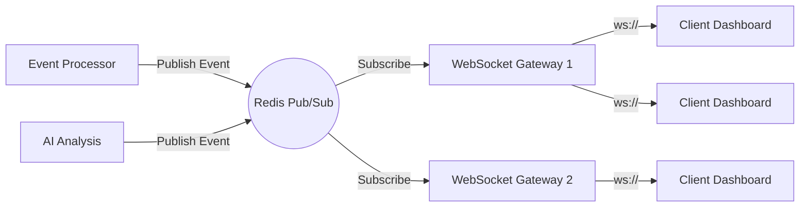

# Real-Time WebSocket Architecture

SentinelAI features a "Cinematic NOC Command Center" that requires sub-millisecond updates without overwhelming the backend with polling requests.

## The Problem with Traditional Polling
If the Next.js frontend polled the FastAPI backend every second for incident updates:
- **Overhead**: High CPU and network overhead for HTTP handshakes.
- **Latency**: Up to 1000ms latency on critical alerts.
- **Database Load**: Constant `SELECT` queries against PostgreSQL.

## The WebSocket + Pub/Sub Solution

We implemented a dedicated `websocket-gateway` service.

### Flow of Execution:
1. **Frontend Connection**: The Next.js client establishes a single, persistent `ws://` connection to the Gateway.
2. **Redis Backplane**: The Gateway subscribes to a Redis Pub/Sub channel (e.g., `sentinel.ws.broadcast`).
3. **Internal Broadcasts**: Whenever a core service creates an incident, updates an event count, or completes an AI analysis, it pushes a lightweight JSON payload to Redis.
4. **Fan-out**: Redis pushes the payload to all connected Gateway instances, which immediately flush the payload down the WebSocket to the clients.
5. **State Reconciliation**: The React frontend uses `framer-motion` to animate the new data into the DOM without requiring a full page refresh.

### Resilience
The React custom hook (`useWebSocket.ts`) implements an exponential backoff reconnect strategy. If the Gateway container restarts, the UI seamlessly reconnects and requests a state sync.
